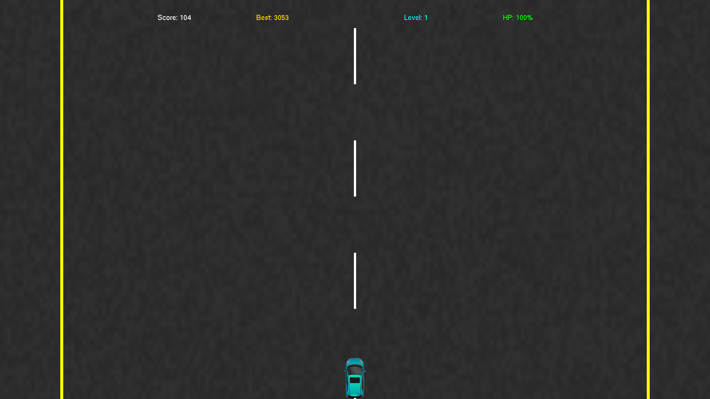
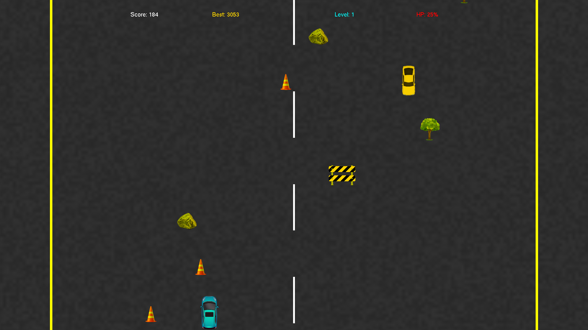
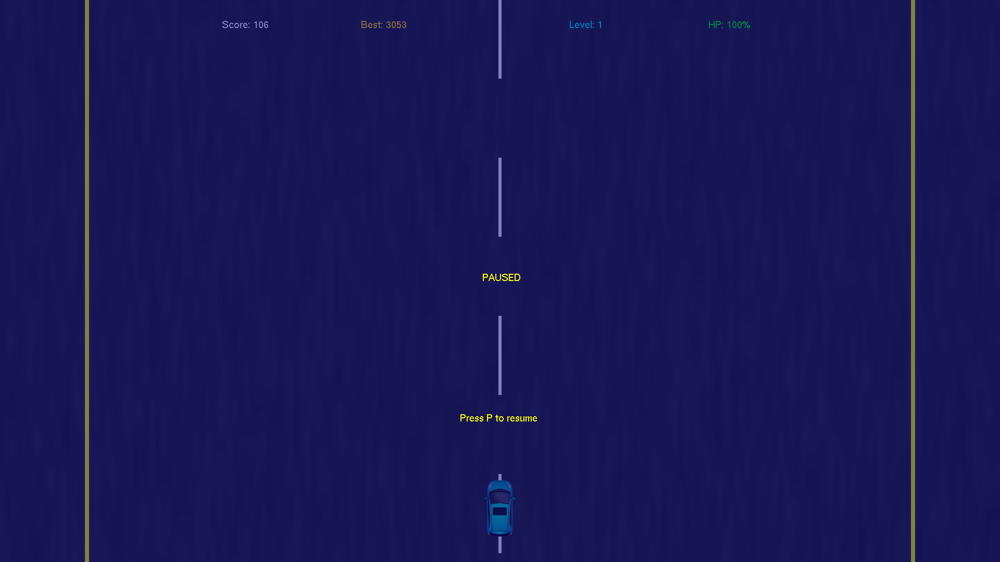
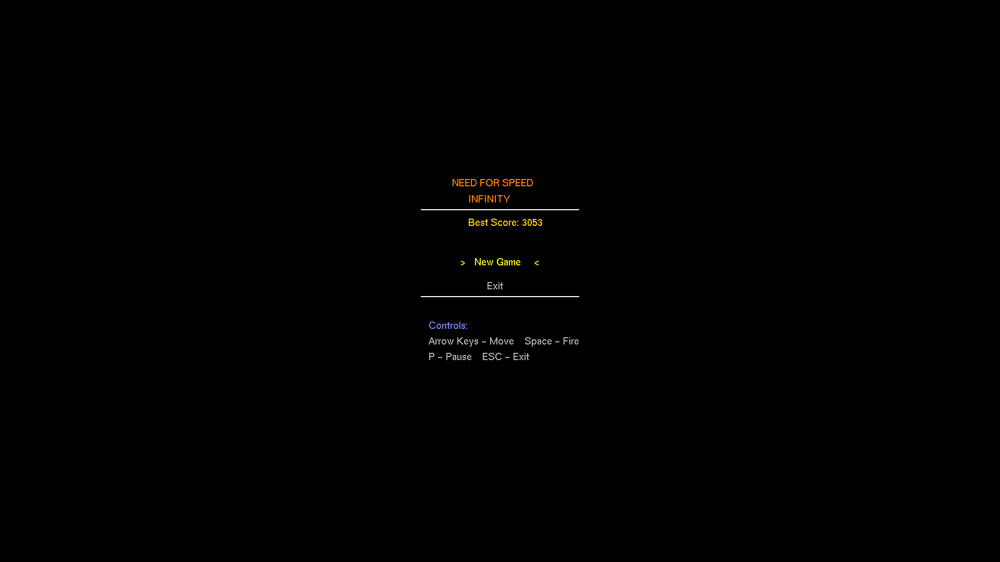

# NeedForSpeedInfinity

A 2D Vertical Scrolling Racing Game developed using C++ and OpenGL for the Computer Graphics course at Baku Engineering University.

## Project Information
- **University**: Baku Engineering University
- **Faculty**: Information and Computer Technologies
- **Department**: Cyber Security and Computer Engineering
- **Course**: Computer Graphics SDF-2 Project


## Table of Contents
1. [Introduction](#introduction)
2. [Project Overview](#project-overview)
3. [Core Game Features](#core-game-features)
4. [Technical Implementation](#technical-implementation)
5. [Game Screenshots](#game-screenshots)
6. [Build and Run](#build-and-run)
7. [Controls](#controls)
8. [Project Structure](#project-structure)
9. [Dependencies](#dependencies)
10. [License](#license)
11. [Detailed Implementation](#detailed-implementation)
12. [Submission Report](#submission-report)

## Introduction
NeedForSpeedInfinity is a fast-paced, arcade-style racing game developed using C++ and the OpenGL graphics library. The game features an endless scrolling road where players must navigate through obstacles and enemy vehicles while maintaining high speeds. This project was developed as part of the Computer Graphics course requirements, demonstrating practical implementation of computer graphics concepts.

## Project Overview
The game implements a vertical scrolling racing experience with the following key components:
- Dynamic road system with synchronized lane markings
- Player-controlled vehicle with movement and shooting mechanics
- Various obstacles and enemy vehicles
- Scoring system with high score persistence
- Multiple game states (Menu, Playing, Paused, Game Over)

## Core Game Features
- **Endless Scrolling Road**: Procedurally textured road that creates the illusion of high-speed travel
- **Dynamic Obstacles**: Multiple types of obstacles (Barriers, Cones, Rocks, Trees) randomly generated
- **Enemy Vehicles**: AI-controlled cars that add challenge to gameplay
- **Player Controls**: Responsive keyboard controls for movement and shooting
- **Projectile System**: Ability to fire projectiles to destroy obstacles and enemies
- **Collision Detection**: AABB-based collision system
- **Health System**: Player health management with damage mechanics
- **Scoring System**: Points awarded for survival time, destroying obstacles, and enemy cars
- **Progressive Difficulty**: Increasing speed and spawn rates based on score
- **High Score Persistence**: Saves and loads highest achieved score
- **Game States**: Clear transitions between different game states
- **HUD**: In-game display showing score, health, and level information

## Technical Implementation
The game is built using:
- **C++**: Core programming language
- **OpenGL**: Graphics rendering
- **FreeGLUT**: Window management and input handling
- **GLEW**: OpenGL extension management
- **stb_image**: Texture loading

Key technical features:
- 2D rendering with orthographic projection
- Texture mapping and sprite rendering
- Collision detection using AABB
- State management system
- Event handling and input processing
- File I/O for high score persistence

## Game Screenshots
<div style="display: flex; flex-wrap: wrap; justify-content: center; gap: 10px;">
  
  
  
  
  
</div>

## Build and Run
1. Ensure you have the following dependencies installed:
   - Visual Studio 2019 or later
   - OpenGL development libraries
   - FreeGLUT
   - GLEW

2. Clone the repository:
   ```bash
   git clone https://github.com/yourusername/NeedForSpeedInfinity.git
   ```

3. Open the solution file `NeedForSpeedInfinity.sln` in Visual Studio

4. Build the project (F7 or Build > Build Solution)

5. Run the executable (F5 or Debug > Start Debugging)

## Controls
- **Arrow Keys**: Move the car
- **Space**: Fire projectiles
- **P**: Pause game
- **ESC**: Exit game

## Project Structure
```
NeedForSpeedInfinity/
├── assets/           # Game assets and resources
│   └── raw/         # Raw asset files (PSD, SVG, etc.)
├── extras/          # Additional files
│   ├── screenshots/ # Game screenshots
│   └── SDF-2 OpenGL Project.pdf  # Project report
├── include/         # Header files
│   ├── Car.h       # Car class definition
│   ├── Level.h     # Level management
│   ├── Texture.h   # Texture handling
│   └── stb_image.h # Image loading library
├── lib/            # External libraries
│   ├── freeglut.dll
│   └── glew32.dll
├── src/            # Source files
│   ├── Camera.cpp  # Camera management
│   ├── Car.cpp     # Car implementation
│   ├── Game.cpp    # Main game logic
│   ├── Level.cpp   # Level implementation
│   ├── Shader.cpp  # Shader management
│   ├── Texture.cpp # Texture implementation
│   ├── Timer.cpp   # Game timing
│   ├── Track.cpp   # Track generation
│   └── VectorMath.cpp # Math utilities
├── textures/       # Game textures
│   ├── car.png
│   ├── enemycar.png
│   ├── road.jpg
│   └── various obstacle textures
└── x64/           # Build output
    └── Debug/     # Debug build files
```

## Dependencies
- **OpenGL**: Core graphics library
- **FreeGLUT**: Window management and input handling
  - Download: [FreeGLUT Development Version](https://www.transmissionzero.co.uk/software/freeglut-devel/)
- **GLEW**: OpenGL extension management
  - Download: [GLEW 2.2.0](https://sourceforge.net/projects/glew/files/glew/2.2.0/)
- **stb_image**: Single-file image loading library by Sean Barrett
  - Source: [stb_image.h](https://github.com/nothings/stb/blob/master/stb_image.h)
  - Note: Included in the project's include directory

## License
This project is licensed under the MIT License - see the LICENSE file for details.

## Detailed Implementation

### Graphics Rendering
- Utilizes OpenGL's fixed-function pipeline for 2D rendering
- Implements orthographic projection for 2D view
- Uses texture mapping for road, cars, and obstacles
- Implements sprite-based rendering for game elements

### Game Loop and Timing
- Implements a fixed-time step game loop
- Uses GLUT's timer function for consistent updates
- Manages game state transitions smoothly
- Handles frame rate independent movement

### Movement and Boundaries
- Implements smooth car movement with acceleration/deceleration
- Enforces road boundaries to prevent off-road driving
- Handles collision detection with obstacles
- Manages enemy car movement patterns

### Collision Detection
- Uses Axis-Aligned Bounding Box (AABB) for collision checks
- Implements projectile-obstacle collision
- Handles car-obstacle and car-enemy collisions
- Manages collision response and damage calculation

### Input Handling
- Implements keyboard input using GLUT callbacks
- Handles multiple key presses simultaneously
- Provides smooth control response
- Manages game state transitions through input

### State Management
- Implements distinct game states (Menu, Playing, Paused, Game Over)
- Handles state transitions with proper cleanup
- Manages UI elements per state
- Implements state-specific rendering

## Submission Report
For a comprehensive understanding of the project, please refer to the detailed submission report:
[Project Report PDF](extras/MidTerm-Report-Trimmed.pdf)

The report includes:
- Detailed project description
- Implementation methodology
- Technical challenges and solutions
- Performance analysis
- Future improvements
- Code documentation
- References and resources

## Acknowledgments
- Baku Engineering University
- Computer Graphics Course Faculty
- OpenGL Community
- FreeGLUT and GLEW developers

